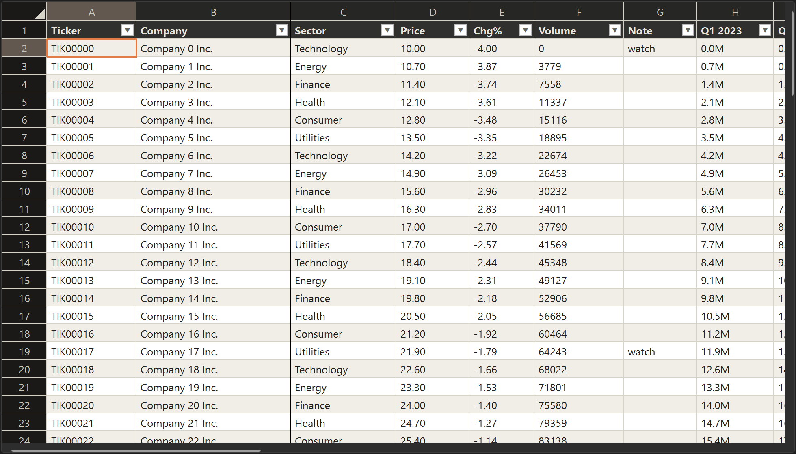

<p align="center">
  
</p>

An OpenGL spreadsheet grid for tens of thousands of rows. Only visible cells
are built, so scroll, select, filter and find stay instant. A GUI-free core
holds the logic, under a thin Tk or Qt host.



## Requirements

| Requirement | Details |
|---|---|
| **Platform** | The renderer is OpenGL 1.1 (`core/glsurface.dll` / `.so`): Windows (WGL + GDI) and Linux (GLX + FreeType). No macOS backend. |
| **Python 3.8+** | |
| **Tk host** | Standard library only (`tkinter`). |
| **Qt host** | Needs `PySide6` (`pip install PySide6`), the only dependency, and only for the Qt host. |
| **Native libs** | The wheel bundles `glsurface` (OpenGL renderer) and `gridcore` (C++ data core). Both required; build from source needs CMake + a C++17 compiler (MSVC on Windows; GCC/Clang + GL/X11/FreeType dev headers on Linux). |

## Install

```bash
pip install fastpygrid            # Tk host (stdlib only)
pip install fastpygrid PySide6    # add the Qt host
```

## Example

### Tk

```python
from fastpygrid.render.tk import make_sheet         # tkinter host (stdlib only)
win = make_sheet(
    ["Ticker", "Company", "Sector", "Price"],
    [["AAPL", "Apple Inc.", "Technology", "189.20"],
     ["XOM",  "Exxon Mobil", "Energy",   "104.10"]],
    frozen_columns=2,   # pin the first 2 columns against horizontal scroll
)
win.mainloop()
```

### Qt

```python
from fastpygrid.render.qt import make_sheet          # PySide6 host
win = make_sheet(headers, rows, frozen_columns=2)
win.mainloop()                                          # aliases app.exec()
```

## Interface

`make_sheet()` (in both `fastpygrid.render.tk` and `fastpygrid.render.qt`) opens a
window and returns a `GridModel` for styling cells, dropdowns and dividers.

`col` is 0-based. `gr` is a **grid row** where rows `0 .. header_rows-1`
are the header and data starts at `gr=header_rows` (so `gr=1` with one header row).

### `make_sheet(headers, rows, ...)`

Builds the model, opens the window, returns it. Raises `RuntimeError` if a required
native lib (`glsurface` or `gridcore`) is missing.

| Argument | Type | Default | What it does |
|---|---|---|---|
| `headers` | `list[str]` or `list[list[str]]` | required | Column titles. A list of lists gives stacked headers, where adjacent equal labels in the upper rows merge into group bands. |
| `rows` | `list[list]` | required | The data, row by row. Values are stringified. |
| `frozen_columns` | `int` | `0` | Pin this many leading columns against horizontal scroll. |
| `view_only` | `bool` | `False` | Read-only sheet: no edit, paste or delete. |
| `master` | widget | `None` | Parent window. Given one, opens as a child instead of a new top-level app. |
| `col_w` | `list[int]` | `None` | Per-column pixel widths. `None` auto-sizes. |
| `title` | `str` | host default | Window title. |
| `uncap_rows` | `bool` | `False` | Lift the built-in row-count cap. |
| `uncap_cols` | `bool` | `False` | Lift the built-in column-count cap. |
| `filters` | `bool` | `True` | Show the per-column header filter/sort ▼ dropdowns. `False` hides them. |

Returns the host window: a `tk.Tk` (or `Toplevel`) for Tk, a `QWidget` for Qt.
Both carry `.mainloop()` (Qt aliases `app.exec()`), `.model` (the `GridModel`),
and `.grid_view` (the grid widget).

```python
from fastpygrid.render.tk import make_sheet
win = make_sheet(
    ["Ticker", "Company", "Sector", "Price"],
    [["AAPL", "Apple Inc.", "Technology", "189.20"],
     ["XOM",  "Exxon Mobil", "Energy",    "104.10"]],
    frozen_columns=2,
)
win.mainloop()
```

### Reading and writing cells

Reach the model through `win.model`.

| Call | Returns | What it does |
|---|---|---|
| `cell(gr, col)` | `str` | Text at that grid row/column (`""` if out of range). |
| `nrows()` | `int` | Total grid rows: header rows plus data. |
| `ncols` | `int` | Column count (a property, no parens). |
| `set_cell(gr, col, text)` | `bool` | Write a cell. Goes through undo. Returns `False` if unchanged or read-only. |
| `set_data(headers, rows)` | `None` | Swap in a new sheet, resetting filters, sort and undo. |

```python
m = win.model
m.cell(1, 0)                 # 'AAPL'
m.set_cell(1, 3, "191.55")   # bump Apple's price, returns True
m.ncols                      # 4
```

### Styling and dropdowns

Styles and choices are keyed to the data, so they follow a row through sort and
filter.

| Call | What it does |
|---|---|
| `set_cell_style(gr, col, fg=None, bg=None, bold=None)` | Style one cell. `fg`/`bg` are `#rrggbb`. `None` leaves an attribute as-is. |
| `set_cell_choices(gr, col, choices)` | Turn one cell into a dropdown offering `choices`. `None` clears it. |
| `set_col_choices(col, choices)` | Same for a whole column, one O(1) call. A per-cell choice overrides it. |

```python
m.set_cell_style(1, 3, fg="#c0392b", bold=True)      # Apple's price in bold red
m.set_col_choices(2, ["Technology", "Energy", "Healthcare"])   # Sector is a dropdown
```

### Dividers and locked cells

Dividers are positional (keyed by index), so they stay put when data moves.
Read-only rows are keyed to the data and follow it.

| Call | What it does |
|---|---|
| `set_vline(col, on=True)` | Thick black rule on the right edge of a column. |
| `set_hline(gr, on=True)` | Thick black rule on the bottom edge of a grid row. |
| `set_readonly_col(col, on=True)` | Block edit/paste/delete in a column (still selectable and copyable). |
| `set_readonly_row(gr, on=True)` | Same, for a row. |

```python
m.set_vline(1)              # rule after the 'Company' column
m.set_hline(0)              # rule under the header
m.set_readonly_col(0)       # Ticker can't be edited
```

## Build

```bash
build.bat
```

Runs `python -m build`, which drives CMake to compile the DLLs and produce
`dist/fastpygrid-*.whl` + `.tar.gz` (same artifacts as CI/PyPI). Needs CMake,
MSVC, and Python's `build`. Re-run after any `.cpp`/`.py` change.

## Run demo

After `build.bat`, launch the OpenGL demo. It copies the built DLLs out of
`dist/*.whl` on first run, then prompts for the tk or qt host:

```bash
demos\demo.bat                                           # prompts for tk or qt
demos\demo.bat tk                                        # tkinter host, 100k rows
demos\demo.bat qt                                        # Qt host, same data
demos\demo.bat tk --rows 500000                          # stress it
```

The tk host needs nothing extra. The qt host needs PySide6: run `demos/setup.bat`
once to create `demos/.venv` (PySide6 + the wheel), which `demo.bat` then uses
automatically.

```bash
demos\.venv\Scripts\python scripts/tests/check_select.py # selection-state-machine check
```

## Layout

```
Fast-Python-Grid/
|-- fastpygrid/             # the python package
|   |-- core/               # model, geometry, selection, rendering, gpu.py (OpenGL engine)
|   |                       #   glsurface + gridcore libs compile in here, beside their loaders (not committed)
|   |-- render/             # tk.py (tkinter host), qt.py (PySide6 host)
|   `-- csrc/               # C++ sources: glsurface.cpp, gridcore.cpp
|-- CMakeLists.txt          # compiles the DLLs (scikit-build-core)
|-- build.bat               # python -m build -> dist/*.whl + *.tar.gz (same as CI/PyPI)
|-- demos/                  # demo_gpu_tk.py, demo_gpu_qt.py, _data.py, setup.bat (wheel into demos/.venv)
`-- scripts/
    |-- tests/              # check_select.py (needs fastpygrid installed)
    `-- benchmarks/         # bench_geometry.py (need fastpygrid installed)
```
